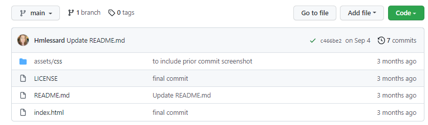
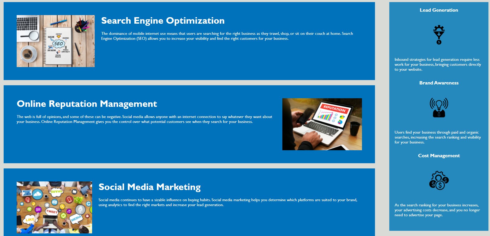
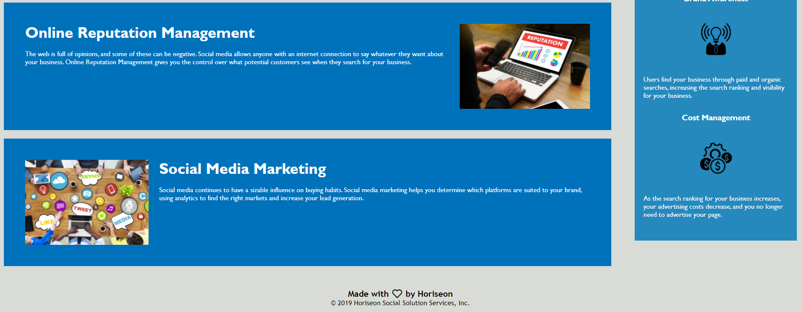

# Horiseon-HTML-CSS

## Table of Contents
--------------------

* Introduction
* User Story
* Live Link & Screenshots
* Technologies Used
* Contact Info

## Introduction
---------------

Refactoring HTML and CSS is needed to meet accessibility standards, and follow a logical structure 

## User Story
-------------

A marketing agency wants a codebase that follows accessibility standards so that their website is optimized for search engines.

## Live Link & Screenshots
--------------------------

**View the application here:** [Horiseon](https://hmlessard.github.io/Horiseon-HTML-CSS/ "Horiseon Marketing")

**View website screenshots here:**
I was in a prior bootcamp class before transfering to start over.  There is a screenshot of my origina repo, but I also updated the code from my original submission and made a new, better named, repo for it.

## Technologies Used
--------------------

* HTML
* CSS

## Contact Info
---------------

If you have any questions about this repo, please feel free to contact me at lessard1228@gmail.com or through GitHub: [Hmlessard](https://github.com/Hmlessard/ "Hmlessard")